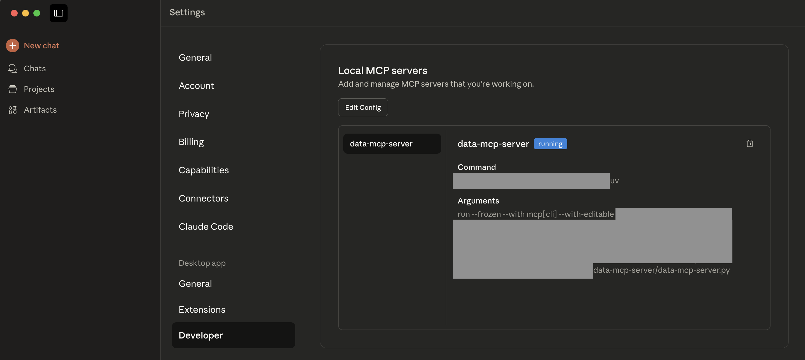

# data-mcp-server

Simple Python Data Analytics MCP Tool Server

---

## Contents
1. [Overview](#1-overview)
2. [Repository Structure](#2-repository-structure)
3. [Deployment](#3-deployment)
4. [Design Philosophy](#4-design-philosophy)
5. [Sample Datasets](#5-sample-datasets)
6. [References](#6-references)
7. [License](#7-license)
8. [Author](#8-author)

---

## 1. Overview

This project is a **prototype** Data Analytics MCP Tool server that integrates deterministic Python analysis with LLM-driven interpretation, demonstrating a lightweight, controlled workflow through the Model Context Protocol (MCP). The server:

- Loads **CSV**, **row-based JSON**, or **row-based YAML** datasets.
- Performs simple **Python analysis**: basic information, numeric summary, categorical summary.
- Outputs in plain text, readable by humans, and suitable for **LLM interpretation**.
- Utilises LLM to provide a short summary of insights. 

---

## 2. Repository Structure

Python Files
- [`data_mcp_server.py`](data_mcp_server.py) - Main Python Application

Datasets
- [`datasets/`](datasets/)
  - employee_performance
    - `datasets/employee_performance.csv`
    - `datasets/employee_performance.json`
    - `datasets/employee_performance.yaml`
  - sales_data
    - `datasets/sales_data.csv`
    - `datasets/sales_data.json`
    - `datasets/sales_data.yaml`    

Images
- [`images/`](images/) - Folder containing screenshots

uv Project Files
- `pyproject.toml`
- `uv.lock`

---

## 3. Deployment

Follow these steps to get the project running:

### 1. Install UV

**macOS / Linux:**
```bash
curl -LsSf https://astral.sh/uv/install.sh | sh
```

**Windows (PowerShell):**
```powershell
powershell -ExecutionPolicy ByPass -c "irm https://astral.sh/uv/install.ps1 | iex"
```

### 2. Clone the repository

```bash
git clone https://github.com/bernardtse/data-mcp-server.git
cd data-mcp-server
```

### 3. Create and sync a UV-managed virtual environment

```bash
uv sync
```

### 4. Download and install Claude Desktop

- Instructions can be found [here](https://www.claude.com/download)

### 5. Install the MCP server onto Claude Desktop

```bash
uv run mcp install -e ./ data_mcp_server.py
```

### 6. Run the MCP server on Claude Desktop

- Start Claude Desktop (or restart the app if it is already open).
- Check that `data-mcp-server` is enabled and running:
    - Menu → Settings → Developer → Local MCP servers

- Click the **Search and Tools** button located directly under the input field. Check that the `data-mcp-server` tool is enabled.
- Write a prompt to trigger data analysis. Make sure the prompt includes the **full pathname of the dataset file** (the pathname in the screenshot is just for reference).


### 7. Developer Mode (Dev Mode) and Others

- Developers can activate **Dev mode** by running the following command in the repository folder:
```bash
uv run mcp dev data_mcp_server.py
```

- To run the MCP server on other 3rd party clients (e.g. Cursor, Goose, etc.), you may need to look for MCP configuration settings within the app. In some cases, the settings panel opens the configuration file (JSON), which you'll need to edit directly. After saving any changes, restart the client.

```
{
  "mcpServers": {
    "Simple Python Data Analytics MCP Tool Server":{
      "command": "uv",
      "args": [
      "--directory",
      "pathname-of-local-repository",
      "run",
      "data_mcp_server.py"
      ]
    }
  }
}
```

**Notes:**
- You'll need to specify the **full pathname** of the local repository folder.
- In some cases, the command `uv` may not work. If this happens, try the following:

    **macOS / Linux:**
    - In the Terminal, run the `which uv` command to locate the directory for **uv**.
    - In the configuration JSON file, replace `uv` with the full path to **uv**, e.g. `/Users/username/.local/bin/uv`.


    **Windows (Powershell):**
    - Run the `where uv` command to display the full path to the `uv.exe` file.
    - In the configuration JSON file, replace `uv` with the pathname of `uv.exe`, e.g. `C:\\Users\\username\\.local\\bin\\uv.exe`.
    - If this still doesn't work, try adding `cmd /C` before `uv` or the pathname of `uv.exe`:
        - `cmd /C uv`
        - `cmd /C C:\\Users\\username\\.local\\bin\\uv.exe` (adjust the pathname as necessary)

---

## 4. Design Philosophy

### Why Hybrid (Python + LLM)?

Both pure Python analysis and fully LLM-driven workflows have inherent trade-offs:
- **Pure Python:** Deterministic and precise, but lacks natural-language summarisation or flexible interpretation.
- **Pure LLM:** Adaptable and expressive, but non-deterministic. Results can vary and are difficult to reproduce.

This hybrid MCP server demonstrates a **controlled orchestration** between the two. It highlights scenarios where deterministic computation and probabilistic reasoning complement each other:
- **Reproducibility & determinism:** Python ensures calculations are precise, auditable, and repeatable.
- **Controlled processing:** Quantitative results come from direct computation, not probabilistic inference.
- **LLM as interpreter:** Provides human-readable explanations, contextual insights, and narrative summaries.
- **MCP as bridge**: Coordinates modular interaction between Python tools and LLMs in a reproducible, structured workflow.

### MCP Tool-Only Design

This prototype implements only **tool-calling** functionality (`mcp.tool()`), omitting `mcp.prompt()` and `mcp.resource()`.
The design rationale:
- As of **November 2025**, most third-party MCP clients provide stable support primarily for `mcp.tool()`.
- This approach simplifies implementation and avoids exposing unnecessary instructions or UI elements.
- It keeps the workflow focused on deterministic Python execution, allowing the LLM to interpret outputs naturally.

### Other Design Choices
- Uses **stdio** transport for simplicity, portability, and compatibility across environments.
- Keeps the architecture lightweight and transparent for easier debugging and integration.
- Recognises that the **MCP protocol** is still evolving, so this implementation favours clarity and maintainability over feature completeness.

### Technologies Used
- **Model Context Protocol (MCP)** - An open protocol introduced by [Anthropic](https://www.anthropic.com) that enables seamless integration between LLM applications and external data sources and tools
- **Python 3** - Core language for deterministic data analysis
-	**FastMCP** - Lightweight framework for building MCP servers
-	**pandas** - Data loading, transformation, and statistical summaries
-	**PyYAML** - Parsing of YAML datasets
- **uv** - Python package and project manager
- **Claude Desktop** (MCP client) - Provides LLM-driven interpretation of Python analysis.

---

## 5. Sample Datasets

There are [2 sets of data](datasets/): `employee_performance` and `sales_data`, available in **CSV**, **JSON** and **YAML** formats.

All JSON or YAML datasets are **row-oriented** (list of records) to mirror CSV semantics and ensure reliable parsing with `pandas`. Column-oriented data structures (where each key maps to a list of values) are **not used**, as `pandas.read_json` and `yaml.safe_load` expect record-oriented data for default tabular conversion.

### Snippets

`datasets/sales_data.csv`
```
month,revenue,units_sold,best_performing_region
Jan,12000,300,North
Feb,15000,400,South
```

`datasets/sales_data.json`
```
[
  {"month": "Jan", "revenue": 12000, "units_sold": 300, "best_performing_region": "North"},
  {"month": "Feb", "revenue": 15000, "units_sold": 400, "best_performing_region": "South"}
]
```

`datasets/sales_data.yaml`
```
- month: Jan
  revenue: 12000
  units_sold: 300
  best_performing_region: North
- month: Feb
  revenue: 15000
  units_sold: 400
  best_performing_region: South
```

---

## 6. References

- **Build an MCP Server**: https://modelcontextprotocol.io/docs/develop/build-server
- **MCP Python SDK**: https://github.com/modelcontextprotocol/python-sdk
- [MCP Server for Data Exploration](https://github.com/reading-plus-ai/mcp-server-data-exploration): A robust Data Analytics MCP server created and run by [ReadingPlus.AI LLC.](https://readingplus.ai)

---

## 7. License

- This project is licensed under the **MIT License**. See the [LICENSE](LICENSE) file for details.
- Developers are encouraged to enhance this prototype with additional features, support, and MCP API usage as desired.

---

## 8. Author

- Developed and maintained by [Bernard Tse](https://github.com/bernardtse), with support from [OpenAI](https://openai.com)’s ChatGPT for code refinement, optimisation, and debugging assistance.
